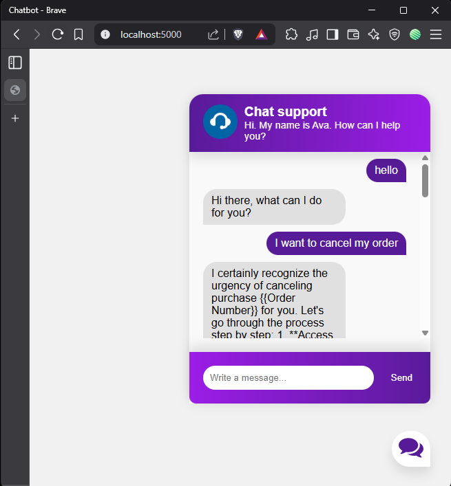
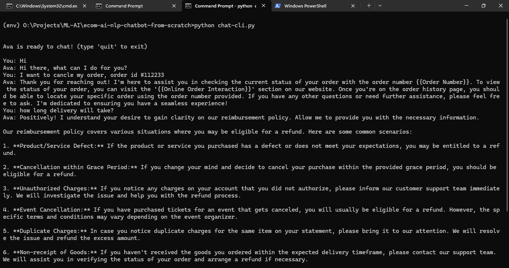

<div align="center">
<h1>
🛍️ E-commerce NLP Chatbot (From Scratch)
</h1> 

Opensource License under MIT
<br /> 
[](https://opensource.org/licenses/MIT)

Build with tools
<br />
[](https://www.python.org/)
[](https://pytorch.org/)
[](https://www.nltk.org/)
[](https://numpy.org/)




</div>

## Overview
A cutting-edge AI chatbot optimized for e-commerce environments, combining natural language processing and neural networks for sophisticated customer interactions.

### Mode
- **Web UI**: We used flask for web interface
- **CLI**: You can also use it as CLI

### Key Capabilities
- **🧠 Natural Language Understanding** with contextual awareness
- **📦 Product inquiry handling** for coffee/tea domains
- **💰 Payment method guidance** and support
- **🚚 Delivery schedule explanations**
- **😄 Random joke generation** for customer delight

## 🧩 Core Architecture
| Feature | Description |
|---------|-------------|
| **Python Native** | Full Python implementation with PyTorch |
| **✅ Extendable** | Add new intents via JSON configuration |
| **⚡ Efficient** | Lightweight design with optimized resources |
| **🧠 NLP Foundation** | Employs essential NLP techniques like tokenization, stemming and bag-of-words |

## Dataset
- https://github.com/bitext/customer-support-llm-chatbot-training-dataset


## ⚙️ Technical Requirements
- **Python 3.9+** or higher
- **NLTK** (Natural Language Toolkit)
- **NumPy** for numerical operations
- **PyTorch** for neural network implementation
- **CPU friendly** - No GPU required for inference, though training benefits from one

## 🚀 Quick Start Guide
1. Clone the repository:
```shell
git clone https://github.com/mr-teslaa/ecom-ai-nlp-chatbot-from-scratch.git
cd ecom-ai-nlp-chatbot-from-scratch
```

2. Create and activate virtual environment (Windows):
```shell
> python -m venv env
env\Scripts\activate
```

3. Install required dependencies:
```shell
pip install nltk numpy torch
```

4. First-time NLTK initialization:
```shell
python -c "import nltk; nltk.download('punkt')"
```

## Training the Model
```shell
python train.py
# Should output: "Training complete. Model saved to data.pth"
```

This script trains the model using `intents.json` and saves the neural network weights, vocabulary, and class tags in `data.pth`.

## Using the Chatbot

For cli
```shell
python chat-cli.py

Ava: Ready to chat! Type 'quit' to exit
```

For web applicaton
```shell
python webapp.py

 * Serving Flask app 'app'
 * Debug mode: off
WARNING: This is a development server. Do not use it in a production deployment. Use a production WSGI server instead.
 * Running on http://127.0.0.1:5000
Press CTRL+C to quit
```

## 🗂️ Project Structure
```
.
├── intents.json          # Training data configuration
├── train.py              # Model training (PyTorch)
├── chat.py               # Interactive chat interface
├── core_ai/              # Core chatbot implementation
│   └── models.py         # Neural network architecture
└── data.pth              # Pretrained model artifacts
```

## 📜 License
MIT License - see [LICENSE](LICENSE) for details
